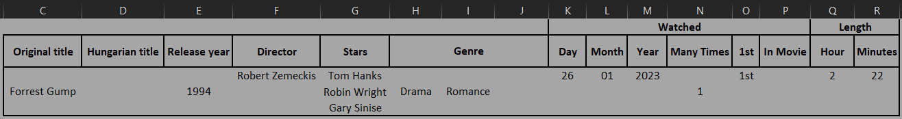
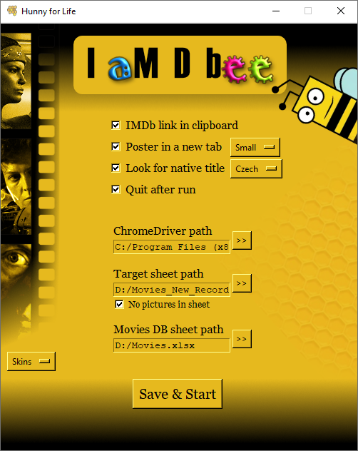
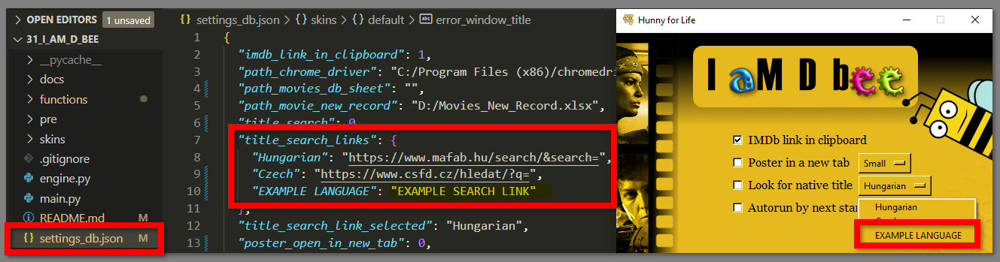

# I aM D bee
- `I aM d bee` collects and copies of your selected motion picture's basic IMDb details to a `target excel sheet`: 

 

- Automatically opens the the sheet, once the data is saved
- If selected: 
    - Opens the movie poster in a new browser tab
    - Searches for the movie on the selected, non-English movie site
- If the path added:
    - Automatically opens your `movie database excel sheet`

     

 

     

# Requirements
## Python and Modules
### Python 3 - used: 3.11
- https://www.python.org/

### Pyperclip
- https://pypi.org/project/pyperclip/

### Selenium
- https://pypi.org/project/selenium/

### Openpyxl
- https://pypi.org/project/openpyxl/

### Fake User Agent
- https://pypi.org/project/fake_user_agent/

## Others
### Google Chrome
- https://www.google.co.uk/chrome/

### Selenium WebDriver
- https://sites.google.com/chromium.org/driver/

### Excel
- Any excel app installed on your system (`MS Excel`, `LibreOffice Calc`)

### Target Excel Sheet
- Recommended: `docs\ Movies_New_Record.xlsx`

### OS
- Windows (tested on 10)
- Linux (tested on Mint 21):
    - Window icon will not be displayed
    - Excel sheets will not open automatically
    - The checkbox text placement can be off, solution:
        - Change the font style to `Arial` in `settings_db.json \ skins \ [every skin] \ font_style`
        - and/or decrease the font size in `main.py \ around line 54 \ checkbox creation for loop \  font = (font_style, 12)`
        
    ### - UNDER CONSTRUCTION -
    - `Chrome driver path`: If the `ChromeDriver` is not in your system path:
        - Chrome driver has no attributes -> will not be selectable in the browse window, how to avoid typing the path:
            1. Rename / add `.exe` attribute to the driver
            2. Select in the browser window -> the path will be displyayed in the field
            3. Remove the `.exe` ending from the path
            3. Remove the `.exe` attribute from the driver
    - `Pyperclip` module: "On Linux, this module makes use of the xclip or xsel commands, which should come with the os. Otherwise run “sudo apt-get install xclip” or “sudo apt-get install xsel” (Note: xsel does not always seem to work.) Otherwise on Linux, you will need the gtk or PyQt4 modules installed. "

# Guide
## IMDb link in clipboard - Mandatory
- You are requested to copy the link of the movie (or series, TV shows, ..)
- It is more for the first-time users

     

## Poster in new tab
- Opens the movie poster in a new browser tab
- Poster size estimates: 
    - Small ~ 190 x 280
    - Medium ~ 280 x 420
    - Larger ~ 380 x 560
- The poster image is not "right-click copyable" from the movie`s front page by default (left)

     

## Look for native title
- Searches for the movie on the selected, non-English movie site:
    - Uses the title and the release year of the movie
    - Adds it to the end of the selected search link
    - Opens it in a new browser tab

## Autorun by next start
- Automatically triggers the scraping engine by the next start of the program using the previously saved settings

## Target sheet path - Mandatory
- Recommended: `docs\Movies_New_Record.xlsx`
- You are able to add the new location of the sheet (if you relocated it)
- If you are using your own sheet:
    - It should NOT contain pictures (`openpyxl` module removes the pictures from the sheet)
    - No merged cells for the `Directors`, `Stars` values (more than one cell can be used in the same column)

## Movies DB sheet path
- You are able to add the location of `movie database excel sheet`
- Not mandatory, no error message, when the field left empty

## ChromeDriver path
### - UNDER CONSTRUCTION -
- If the `ChromeDriver` is not in your system path: you are able to add the path

# Tips and Tricks
## How to add a new "Look for native title" option
- Just add your key-value pair in `settings_db.json \ title_search_links` and it will be automatically listed at the next start
- Make sure your link is suitable for concatenation

     

## How to add a new skin
- In the `skins` folder create a new folder with the name of your skin
- Place your version of `BG.png` and `icon.ico` into the folder (`BG.png`: 500x600)
- In the `settings_db.json \ skins` create a new dictionary with the same name of your folder
- In the `settings_db.json \ skins \ your skin` amend the parameters as you wish
- The new skin will be automatically listed at the next start

     

## How to test your updated skin without running the scraping engine
Scenario: you updated the `BG.png` background picture in an already existing skin
- Change the skin with the `Skins` button for different one and back to the updated one
- Every skin change triggers the `save & update function` (for the skin only)
- Your updated picture should be visible without restarting the program

## Alternative start
Scenario: launching the program without IDE or terminal
- Look around in the the `docs\launcher` folder, if you want to launch the program from your desktop or from Total Commander`s button section
    - Windows: you can create a shortcut for the `.bat` file
- Do not forget to change the path and python types according to your system

## How to use less information/columns from the target sheet with one selection
Scenario: you are native English person, who collects only the English titles of the movies
- No code:
    - Hide the unwanted columns in the `target excel sheet`
    - Save and close it
    - Run the program
    - [Copy visible cells only](https://support.microsoft.com/en-us/office/copy-visible-cells-only-6e3a1f01-2884-4332-b262-8b814412847e)
- Code: amend the `functions \ excel_sheet.py` file to
    - Reduce the information transfered to the sheet
    - Alter the location(cells)

# Modules used, which are part of Python 3
- datetime
- json
- os
- pathlib
- platform
- shutil
- sys
- webbrowser

## Thank you all who worked on the modules listed in this document!