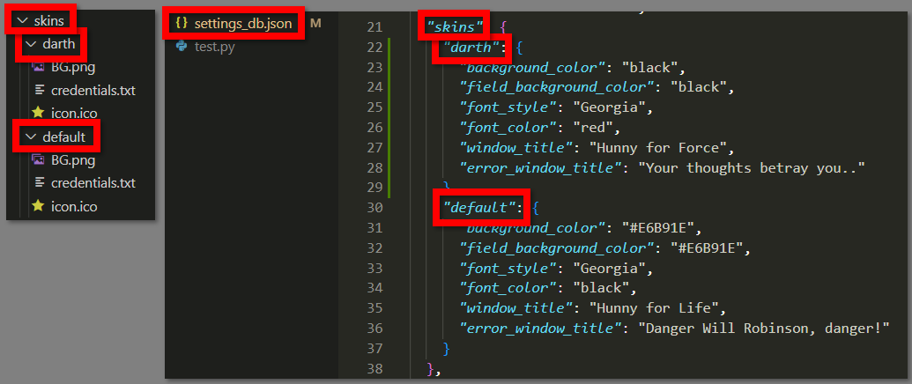

# I aM D bee
## IMDb scraping app for movies, tv shows, tv mini-series..
- Gets the movie`s IMDb link from clipboard
- Copies the details to the `target excel sheet`:
<div align="center">
     
</div>
- Automatically opens the `target excel sheet`, once the data is saved
- If checked in: 
    - Opens the movie poster in a new browser tab - the poster image is not "right-click copyable" from the movie`s front page by default
    - Searches for the movie in another database in a new browser tab - for the non-english user`s native language movie title
- If the path added:
    - Automatically opens your `movie database excel sheet`

<br>

<div align="center">
     
</div>

<br>

<div align="center">
     
</div>

# Requirements
## Python and Mondules
### 1. Python 3
- https://www.python.org/

### 2. Selenium
- https://pypi.org/project/selenium/

### 3. Openpyxl
- https://pypi.org/project/openpyxl/

## Others
### 4. Google Chrome
- https://www.google.co.uk/chrome/

### 5. Selenium WebDriver
- You will be able add the location of the driver via UI
- https://sites.google.com/chromium.org/driver/

### 6. Excel
- Any excel app installed on your system (`MS Excel`, `LibreOffice Calc`)

### 7. Target Excel Sheet
- Recommended: `docs\ Movies_New_Record.xlsx`
- You will be able relocate and add the new location of the sheet via UI
- If you are using your own sheet:
    - It should not contain pictures (`openpyxl` module removes the pictures from the sheet)
    - No merged cells for the Directors, Stars values (where we can write more data in one column)

# Guide
## Options
In progress

# Tips and Tricks
## Save settings
In progress

## How to use less information/columns from the target sheet
No code:
- Hide the unwanted columns in the `target excel sheet`
- Save and close it
- Run the program
- Copy visible cells only, help:
```
https://support.microsoft.com/en-us/office/copy-visible-cells-only-6e3a1f01-2884-4332-b262-8b814412847e
```
Code: amend the `functions / excel_sheet.py` file

## Alternative start
In progress

## How to add your own "Look for native title" option
Just add your key-value pair in `settings_db.json / title_search_links` and it will be automatically listed at the next start.

<div align="center">
     
</div>


## How to create your own skin
- In the `skins` folder create a new folder with the name of your skin
- Place your version of `BG.png` and `icon.ico` in the folder (BG.png: 500x600)
- In the `settings_db.json \ skins` create a new dictionary with the same name of your folder
- In the `settings_db.json \ skins \ your skin` amend the parameters as you wish
- The new skin will be automatically listed at the next start

<div align="center">
     
</div>
